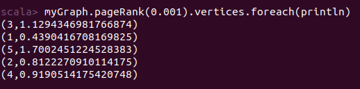
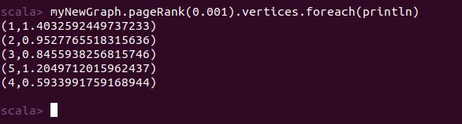

# Lab 9: GraphX Spark

> Rafik Hachana, B19-DS01

### Task 1: Explain the arguments of the `pregel ` function

We have the following function in the assignment's statement:

```scala
val g = Pregel(  
    graph = myGraph.mapVertices((vid,vd) => 0),
    initialMsg = 0,
    maxIterations = Int.MaxValue,
    activeDirection = EdgeDirection.Out 
)(
    vprog = (id:VertexId,vd:Int,a:Int) => math.max(vd,a),
    sendMsg = (et:EdgeTriplet[Int,String]) =>
        Iterator((et.dstId, et.srcAttr+1)),
    mergeMsg = (a:Int,b:Int) => math.max(a,b) 
)

g.vertices.foreach(println(_))
```

Functions arguments:

1. `graph` : The input graph
2. `initialMsg`: The initial message (will be sent to all vertices on the first iteration).
3. `maxIterations`: The number of iterations of the algorithm.
4. `activeDirection`: Determines which edges should pass the message for the next iteration (`EdgeDirection.out` means that only edges that are out-edges of a vertex that received a message in the previous iteration will pass the message in this iteration)
5. `vprog`: A function to process the _merged_ message received by a vertex. (Message processing at the vertex level)
6. `sendMsg`: A function that is applied to the edge that transmits the message for the next iteration (Message processing at the edge level)
7. `mergeMsg`: A function that merges multiple messages (e.g. messages transmitted by multiple edges to the same vertex). The result of this function is then passed to `vprog`

### Task 2: Real-life applications of graph database in Big Data

1. Fraud detection: Graph databases can be used in big financial networks with a lot of transactions between millions of people. They can be used to detect cases of fraud, suspicious transactions and money laundering.
2. Path planning and representing a real-life map: Graph databases can be used to model maps for ground autonomous ground vehicles or for UAVs. The graph can consist of a large number of predefined waypoints with the edges representing the feasibility, distance and cost of moving from one point to another. Path planning algorithms can be applied to find a good mission plan between 2 points on the map.

### Task 3: Updating the given example graph to change the results of `pageRank`

In the lab's statement, we have the graph define in the code below:

```scala
import org.apache.spark.graphx._

val myVertices = sc.makeRDD(Array((1L, "Ann"), (2L, "Bill"),
 (3L, "Charles"), (4L, "Diane"), (5L, "Went to gym this morning")))

val myEdges = sc.makeRDD(Array(Edge(1L, 2L, "is-friends-with"),
 Edge(2L, 3L, "is-friends-with"), Edge(3L, 4L, "is-friends-with"),
 Edge(4L, 5L, "Likes-status"), Edge(3L, 5L, "Wrote-status")))

val myGraph = Graph(myVertices, myEdges)
```

Running page rank on this graph would give the highest rank to the 5th vertex (`(5L, "Went to gym this morning")`) 




Now, we want to make the first vertex (`(1L, "Ann")`) get the highest rank.

Since this vertex is the "source" of the graph (no incoming edges, and we can reach any vertex through the outgoing edge). We can _reverse the direction of every edge in the graph_.

```scala
// Making a new list of edges with the same vertices
val myNewEdges = sc.makeRDD(Array(Edge(2L, 1L, "is-friends-with"),
 Edge(3L, 2L, "is-friends-with"), Edge(4L, 3L, "is-friends-with"),
 Edge(4L, 5L, "Likes-status"), Edge(3L, 5L, "Wrote-status")))

// creating a new graph
val myNewGraph = Graph(myVertices, myNewEdges)

// running pageRank on the new graph
myNewGraph.pageRank(0.001).vertices.foreach(println)
```

We would get the following result:




